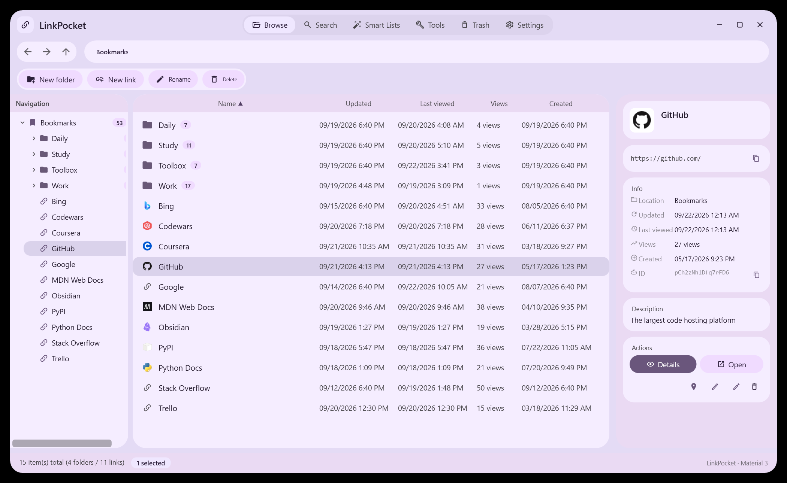

# LinkPocket

**Your links, in one place that is actually yours.** A standalone, local-first personal knowledge base for Windows — import, organize and create your own links: fast to navigate, easy to keep tidy, and portable down to the last file.

---

## Why LinkPocket

- **Standalone, not a browser accessory.** No extension to install and no sync service to trust — your links live in one self-contained library on your machine, whether they came from a browser, an export file, or your own typing.
- **Local first.** No account, no sync service, no telemetry. Everything lives in a single folder next to the app — copy it to a USB stick and your whole library comes along.
- **Built for large libraries.** Tens of thousands of bookmarks stay responsive: virtualized lists, instant folder switching, and background work that never blocks the interface.
- **Nothing destructive happens by accident.** Deleting moves things to a recycle bin, permanent removal and full wipes ask twice, and edits can be undone.

## What you can do

### Organize

- Build a folder tree as deep as you like, drag bookmarks and folders anywhere, and reorder items inside a folder.
- Select many items at once and move, copy, delete, or export them in one go.
- Rename in place, jump between recently visited folders with Back / Forward / Up, and edit the path directly from the address bar.

### Find

- Search the title, the address, your notes, or the folder path — separately or together — and see **which field matched** for every hit.
- Smart Lists collect what matters without any setup: recently added, recently visited, recently edited, most visited.
- Jump straight to a bookmark by its ID, or from any list into the folder it lives in.

### Keep and restore

- Deleting a bookmark or a folder sends it to the **Recycle Bin**, together with its original location.
- Restore an item where it came from; restore a whole deleted folder as one unit, or put it somewhere else on purpose.
- If the original folder no longer exists, LinkPocket says so and places the item at the top level instead of guessing.

### Clean up

- The **duplicate finder** groups bookmarks that share the same address, shows you each group, and lets you keep the one you want — the rest go to the Recycle Bin, not into the void.

### Move your data in and out

- Import bookmarks from standard bookmark files exported by any browser; export them back out at any time.
- Export as JSON or CSV when you want to process your library elsewhere.
- **Full backup in one file** — including descriptions, visit counts, favorites and site icons. A backup is verified when written and validated before it is restored, and it can be restored by later versions of the app.

### Work without fear

- Every edit can be undone — and redone. The history panel shows what is on both stacks.
- Visit counts and "last visited" times are tracked as you browse, so Smart Lists keep getting smarter.
- Mark the bookmarks you rely on as favorites.

### Make it feel like yours

- **11 built-in themes**, plus a color studio: give it your own palette and the entire interface — surfaces, text, highlights, borders — is derived from it.
- Import your own font files and use them across the whole app.
- **简体中文 and English**, switched instantly from the settings — or leave it on **Automatic**: an English Windows gets English, any other display language gets Simplified Chinese. Switching never touches your bookmarks, folders or paths.

## Getting started

1. Download the latest release for Windows.
2. Extract the archive anywhere — a normal folder, a USB stick, a synced drive.
3. Run `LinkPocket.exe`.

There is no installer and nothing to configure. Your library (database, settings, site icons and logs) is created in the folder you extracted, so uninstalling means deleting that folder — and moving your library means moving it.

**Requirements:** Windows 10 or Windows 11 (64-bit).

## Your data and your privacy

- Your bookmarks never leave your machine unless you export them yourself.
- LinkPocket keeps no account and sends no usage data.
- The app uses the network only to serve you: it fetches the title, description and icon of a page **when you add or open a bookmark's details**, and it can look up a site's icon from a third-party icon provider when the site itself does not offer one. Nothing else is requested, and nothing about your library is ever uploaded.

## Interface

*The browse view — your folder tree on the left, the bookmark list in the middle, details for the selected bookmark on the right.*

## Credits

- Icons: [Pictogrammers Material Design Icons](https://pictogrammers.com/library/mdi/) (Apache License 2.0).

## License

[MIT](LICENSE) © 2026 Hrecer
